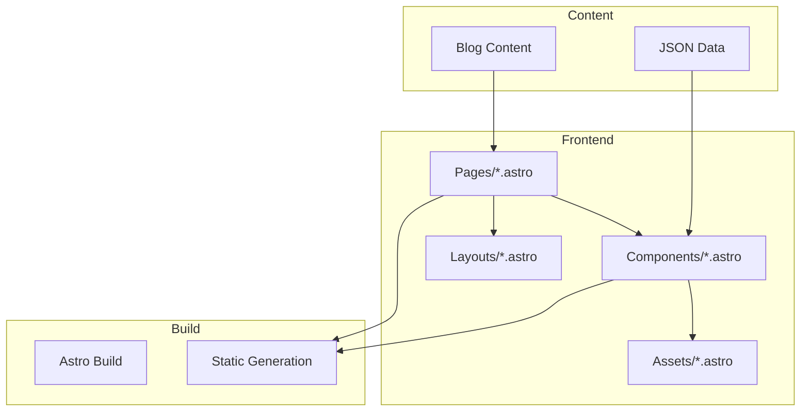

# System Patterns

## Architecture Overview


## Design Patterns

### Component Structure
1. UI Components
   - Atomic design principles
   - Self-contained components
   - Prop-based configuration
   - Consistent styling patterns

2. Layout Components
   - Page templates
   - Reusable layouts
   - SEO optimization

### Data Management
1. Content Organization
   - Markdown blog posts
   - JSON data files
   - Static content integration

2. Data Flow
   - Top-down props pattern
   - Static site generation
   - Content collection APIs

## Implementation Paths

### Page Structure
1. Common Layout
   ```
   Layout.astro
   └── Component Sections
       ├── Navbar
       ├── Main Content
       └── Footer
   ```

2. Blog Posts
   ```
   BlogLayout.astro
   └── Blog Components
       ├── Article Content
       ├── Social Share
       └── Related Posts
   ```

### Component Relationships
1. Page Components
   - Independent, self-contained units
   - Prop-based configuration
   - Consistent styling patterns

2. Shared Components
   - Reusable UI elements
   - Common styling
   - Consistent behavior

## Technical Patterns

### Routing
- File-based routing
- Dynamic routes for blog/projects
- SEO-friendly URLs

### Styling
- Tailwind CSS utility classes
- Component-specific styles
- Global CSS variables

### Performance
- Static site generation
- Image optimization
- CSS/JS optimization
- Lazy loading

### Testing
- Component testing
- Content validation
- Build process verification

## Development Workflow
1. Local Development
   - Hot module reloading
   - Development server
   - Content preview

2. Build Process
   - Static site generation
   - Asset optimization
   - Deploy-ready output

3. Content Management
   - Markdown processing
   - JSON data updates
   - Asset organization
